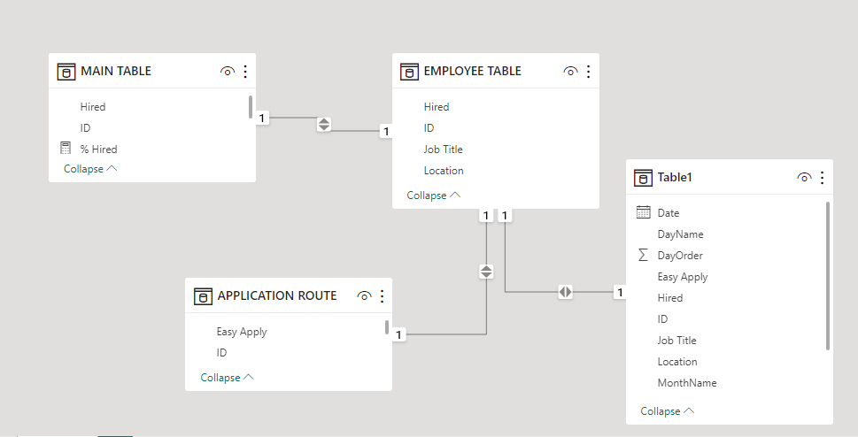
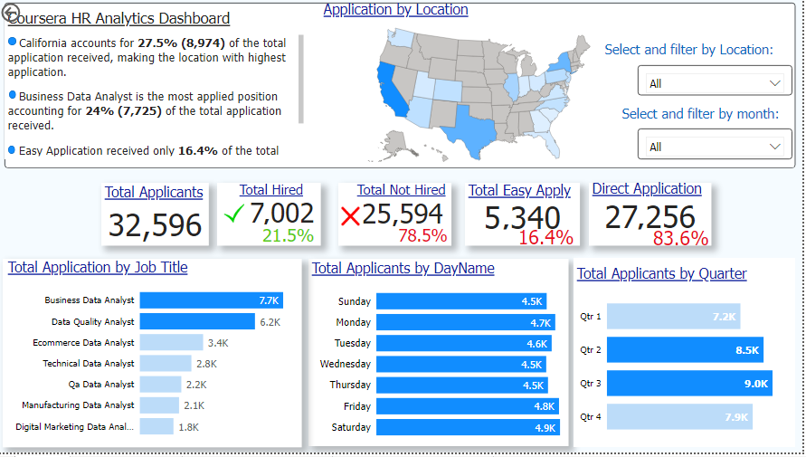
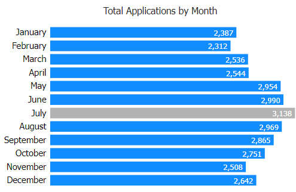
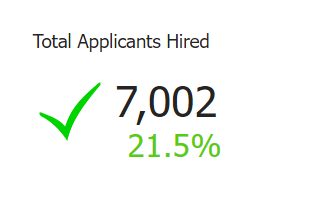
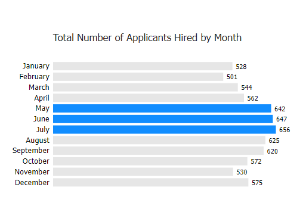
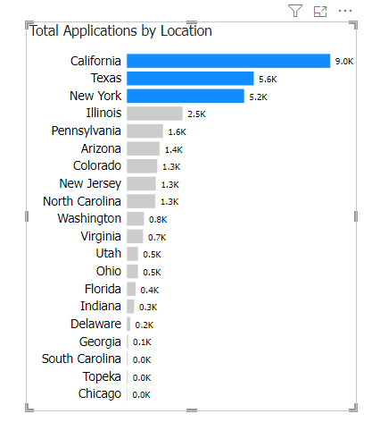
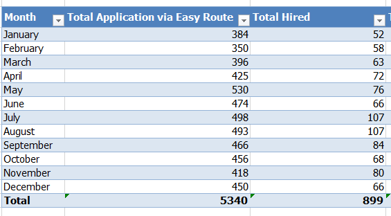
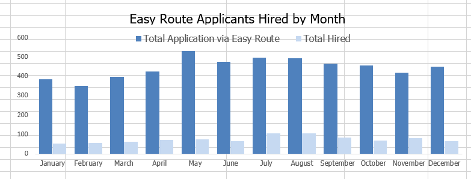
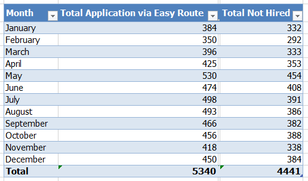
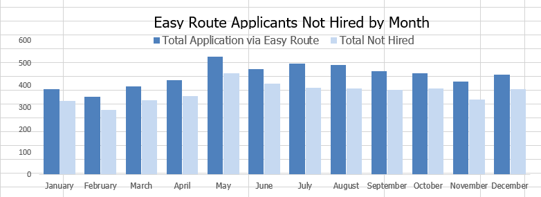

# Coursera_HR_Analyitcs

## Introduction 
In June 2023, I completed the second course of Google Data Analytics with course. Coursera is a renowned online learning platform that provides detailed knowledge on different tech courses.
The dataset used in this analysis was provided by Coursera as part of learning and practicing pivot tables in Google sheet and Microsoft Excel, but having self-learnt Microsoft Power Bi, I decided to use the same dataset to display some Power Bi skills.
This analysis skipped some important data analysis processes like cleaning, this is because the dataset as provided by Coursera was already cleaned.

**_Disclaimer_** : **_This dataset and report might not truly represent Coursera, it might just be a dummy dataset to foster learning and practice._**

## Goals and Objectives 
My objectives in this analysis is to explore the dataset and discover valuable insights based on specific problem questions which can help Human Resource personnel and managers make informed and data-driven decisions. 
Also, the analysis seeks to proffer solutions to the problem questions and offer recommendations to Coursera Human Resources Unit/Team.
## Problem Statements
1. What is the total number of applications received and how does it change over time?
2. What is the total number of applicants hired and how does it vary by month?
3. Calculate application according to geolocation.
4. How many applications were received through easy apply? How many applicants were Hired? How many were not hired? And how does this vary by months?
## Tools used
- Microsoft Excel
- Microsoft Power BI
  
## Skills/Concepts Demonstrated
The following Power BI features were incorporated:
- DAX
- Measures
- Tooltips
- Modelling
- Filters
  
## DAX Measures/Excel Functions
- DAX Measures
1.	Total Applications Received = CountA (‘MAIN TABLE’[Hired]). 
This DAX Measure counts all the rows in the column.

2.	Total Hired = Calculate([Total Applicants],’MAIN TABLE’[Hired] = “Hired”). 
This measure counts and calculates the total number of applicants hired.

3.	% Hired = Divide([Total Hired],[Total Applicants],0)
This means Divide ([Numerator; which is the smaller number],[Denominator; bigger number],0)

4.	Total Not Hired = Calculate([Total Applicants],’MAIN TABLE’[Hired] =  “Not Hired”). 
	This measure counts and calculates the total number of applicants not hired.

5.	% Not Hired = Divide([Total Not Hired],[Total Applicants],0). 
This means Divide ([Numerator; which is the smaller number],[Denominator; bigger number],0)

6. Total Easy Apply = Calculate([Total Applicants],’Application Route’ [Easy Apply] =  “Easy Apply”). 
This measure counts and calculates the total number of applications received through easy apply.

7.	% Easy Apply = DIVIDE([Total Easy Apply],[Total Applicants],0)
	
8.	Total Not Easy Apply = Calculate([Total Applicants],’Application Route’ [Easy Apply] =  “Not Easy Apply”). 
This measure counts and calculates the total number of applications received through direct application.

9.	% Not Easy Apply = DIVIDE([Total Not Easy Apply],[Total Applicants],0)

- Excel Functions
1.	Countifs: This function in Excel is used to count the number of cells in a range that meets multiple criteria.
2.	Sum: This function is used to add up a range of numbers.
   
## Data Modelling
I identified a common field in the tables which is ID and established relationship between them.

## Analysis and Visualization
I have included all the visuals in the report I created. The report contains only one page.

To interact with the report please click here
### Answers to the problem statements.
***
**Question 1: What is the total number of applications received and how does it change over time?**
- Answer: The total number of applications received was **32,596**

   
***
**Question 2: What is the total number of applicants hired and how does it vary by month?**
- Answer: The total number of applicants hired was **7,002** which accounts for **_21.5%_** of the total application received.

         
***
**Question 3: Calculate application according to geolocation.**
- Answer: Applications from California is **8,974** and accounts for **_27.53%_** of the total application received. Texas, with **5,601** accounts for **_17.18%_** of the total application making it the second highest.
  

***
**Question 3: How many applications was received through easy apply and how many were hired? How does it vary  by Month**
 

***

**Question 4: How many applications was received through easy apply and how many were not hired? How does it vary  by Month**

       

***
## Conclusion and Recommendation

This data analytics documentation serves as a comprehensive resource that outlines the process of analysis and provides insights into data gathering, data transformation and data visualization techniques to enable effective decision-making. 

